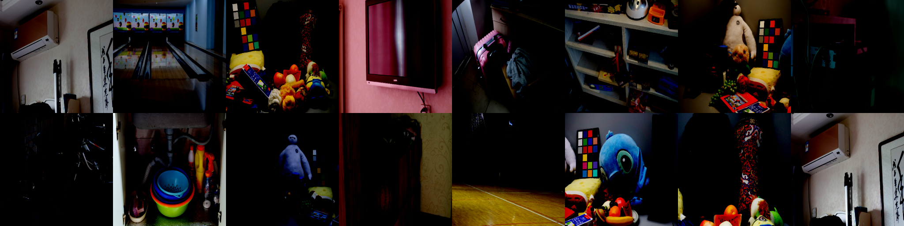
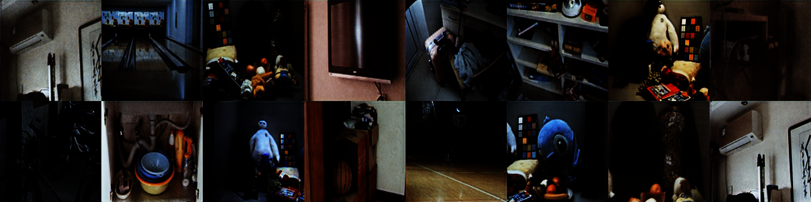

# Low-Light Image Enhancement (Based on Diffusion Models)

[](https://cloud.189.cn/web/share?code=AJ7fUzBbuUzm) (Access Code: q2u9)
[](https://github.com/yourusername/INR2RGB)

This is a deep learning project based on PyTorch and the Diffusers library, **primarily utilizing Conditional Diffusion Models** for low-light image enhancement. The project aims to restore low-light, noisy images to clear, normally lit images.

(Optional) This project also includes earlier implementations based on Generative Adversarial Networks (GAN) (`DeepTranserGAN.py`), but the diffusion model approach is currently recommended.

## Features

- **Core Technology**: Conditional Denoising Diffusion Probabilistic Models (DDPM) implemented based on the `diffusers` library.
- **Conditional Generation**: Uses low-light images as conditions to guide the diffusion process to generate corresponding normally lit images.
- **High-Quality Restoration**: Aims to generate enhanced images with rich details and natural colors.
- **Flexible Configuration**: Supports adjusting model structure, training hyperparameters, and sampling settings via command-line arguments.
- **Accelerate Support**: Uses the `accelerate` library to simplify distributed training and mixed-precision training.
- **Evaluation Metrics**: Uses PSNR and SSIM during training to evaluate model performance.
- **Image and Video Prediction**: Supports enhancement processing for image datasets and individual video files.
- **Modern Package Management**: Uses `uv` for fast and reliable dependency management.

## Demo

_Replace the images below with results generated by your diffusion model._

|           Input (Low Light)           |     Output (Diffusion Enhanced)      |
| :-----------------------------------: | :----------------------------------: |
|  |  |
|      _(Example, please replace)_      |     _(Example, please replace)_      |

## Pre-trained Model

We provide a pre-trained **Diffusion Model UNet** trained on the LOL dataset:

- Model Download: [](https://cloud.189.cn/web/share?code=AJ7fUzBbuUzm) (Access Code: q2u9)
- After downloading and unzipping, you will get a directory containing `diffusion_pytorch_model.bin` and `config.json`. Point the `--model_path` argument to this directory during prediction.

## Environment Requirements

- Python 3.8+
- PyTorch 2.0+
- Libraries like `diffusers`, `accelerate`, `transformers` (see `requirements.txt`)
- CUDA (Strongly recommended for accelerated training and prediction)
- `uv` (Recommended for package management)

## Installation Steps

1.  **Clone the repository:**

    ```bash
    git clone https://github.com/yourusername/INR2RGB.git # Replace with your repository address
    cd INR2RGB
    ```

2.  **Install `uv` (if not already installed):**
    `uv` is a fast Python package installer and resolver.

    ```bash
    # macOS / Linux
    curl -LsSf https://astral.sh/uv/install.sh | sh

    # Windows (requires PowerShell)
    powershell -c "irm https://astral.sh/uv/install.ps1 | iex"

    # Other installation methods: https://github.com/astral-sh/uv#installation
    ```

    Ensure `uv` is in your PATH after installation (you might need to restart your terminal).

3.  **Create and activate a virtual environment (Recommended):**

    ```bash
    # Using uv (Recommended)
    uv venv .venv
    source .venv/bin/activate  # Linux/macOS
    # .venv\\Scripts\\activate  # Windows

    # Or using conda
    # conda create -n inr2rgb python=3.9
    # conda activate inr2rgb

    # Or using venv
    # python -m venv .venv
    # source .venv/bin/activate # Linux/macOS
    # .venv\\Scripts\\activate    # Windows
    ```

4.  **Install dependencies using `uv`:**
    ```bash
    uv pip install -r requirements.txt
    ```
    If you encounter CUDA-related issues, ensure your PyTorch version is compatible with your CUDA version and potentially follow specific installation instructions from the PyTorch website.

## Dataset Preparation

The project uses the LOL dataset (Low-Light paired dataset) or similar **low-light / normal-light paired** datasets.

The dataset structure should be as follows:

```
datasets/
└── <your_dataset_name>/  # e.g., kitti_LOL
    ├── train/             # Training set directory (or structured like LOL dataset)
    │   ├── high/          # Normal light images
    │   └── low/           # Low light images
    └── test/              # Test set directory (or structured like LOL dataset)
        ├── high/          # Normal light images
        └── low/           # Low light images

# Example structure for LOL dataset
datasets/
└── kitti_LOL/
    ├── eval15/            # Often used as test set
    │   ├── high/
    │   └── low/
    └── our485/            # Often used as training set
        ├── high/
        └── low/
```

**Important**: The `LowLightDataset` class (`datasets/data_set.py`) needs to be adjusted based on your specific dataset structure and naming conventions. The current implementation is based on the `eval15` and `our485` directory structure of the LOL dataset.

You can download the LOL dataset from the [official LOL dataset website](https://daooshee.github.io/BMVC2018website/) or use your own dataset (ensure you adjust the `LowLightDataset` implementation).

## Usage

### Training the Diffusion Model

Use the `diffusion_trainer.py` script for training.

1.  **Configure Training Parameters:**
    You can directly modify the default values in the `parse_args()` function within `diffusion_trainer.py` or pass arguments via the command line.

2.  **Run the Training Script:**
    It is recommended to launch training using `accelerate` for easy handling of distributed training and mixed precision.

    **Single GPU Training:**

    ```bash
    accelerate launch diffusion_trainer.py \\
        --data_dir ../datasets/kitti_LOL \\
        --output_dir diffusion_output_lol \\
        --resolution 256 \\
        --train_batch_size 4 \\
        --num_train_epochs 300 \\
        --gradient_accumulation_steps 1 \\
        --learning_rate 1e-4 \\
        --lr_scheduler cosine \\
        --lr_warmup_steps 500 \\
        --mixed_precision fp16 \\
        --checkpointing_steps 5000 \\
        --validation_epochs 10 \\
        --seed 42
        # --enable_xformers_memory_efficient_attention # Enable if xformers is installed
        # --resum latest # Resume from the latest checkpoint
        # --lightweight_unet # Use a lightweight UNet for quick testing
    ```

    **Multi-GPU Training:**
    First, configure `accelerate`:

    ```bash
    accelerate config
    ```

    Follow the prompts to configure your multi-GPU environment (usually select "This machine" and specify the number of GPUs).
    Then, launch using the same command:

    ```bash
    accelerate launch diffusion_trainer.py [other parameters as above...]
    ```

3.  **Monitor Training:**
    Training logs and TensorBoard files will be saved in the `logs` subdirectory within the directory specified by `--output_dir`.
    ```bash
    tensorboard --logdir diffusion_output_lol/logs
    ```
    Model checkpoints will be saved in `checkpoint-<step>` directories under `--output_dir`. The final model will be saved at `--output_dir/unet_final`.

### Prediction using the Diffusion Model

Use the `diffusion_predictor.py` script for prediction.

#### Image Dataset Prediction

```bash
python diffusion_predictor.py \\
    --mode image \\
    --model_path diffusion_output_lol/unet_final \\
    --data_dir ../datasets/kitti_LOL/eval15 \\
    --output_dir diffusion_image_predictions \\
    --resolution 256 \\
    --num_inference_steps 50 \\
    --eval_batch_size 8 \\
    --device cuda
```

#### Single Video Prediction

```bash
python diffusion_predictor.py \\
    --mode video \\
    --model_path diffusion_output_lol/unet_final \\
    --video_path /path/to/your/input_video.mp4 \\
    --output_dir diffusion_video_prediction_output \\
    --resolution 256 \\
    --num_inference_steps 50 \\
    --save_output_video \\
    --save_frame_interval 100 \\
    --device cuda
    # --display_video # Optional: Display processing results in real-time
```

### Prediction Parameter Explanation

- `--mode`: Prediction mode (`image` or `video`).
- `--model_path`: **Required**, path to the **directory containing the trained UNet model** (`diffusion_pytorch_model.bin` and `config.json`).
- `--output_dir`: Root directory to save prediction results.
- `--device`: Device to use (`cuda` or `cpu`).
- `--resolution`: Model input/output resolution (should match training).
- `--num_inference_steps`: Number of diffusion sampling steps.
- `--data_dir` (image mode): Path to the input image dataset.
- `--eval_batch_size` (image mode): Batch size for image prediction.
- `--video_path` (video mode): Path to the input video file.
- `--save_output_video` (video mode): Whether to save the enhanced video.
- `--save_frame_interval` (video mode): Save an enhanced PNG image every N frames.
- `--display_video` (video mode): Whether to display the video frames being processed in real-time.

## Model Evaluation

During training, `diffusion_trainer.py` periodically runs sampling on the validation set (test set) and calculates PSNR and SSIM metrics. These metrics, along with generated sample images, are logged to TensorBoard.

## Project Structure

```
INR2RGB/
├── diffusion_trainer.py      # Diffusion model training script
├── diffusion_predictor.py    # Diffusion model prediction script
├── DeepTranserGAN.py         # (Optional) Old GAN implementation
├── models/                   # Model definitions (includes old GAN models)
│   ├── base_mode.py
│   ├── common.py
│   └── Repvit.py
├── datasets/                 # Dataset handling
│   └── data_set.py           # LowLightDataset class definition
├── utils/                    # Utility functions (some might be GAN-specific)
│   ├── loss.py
│   └── misic.py
├── requirements.txt          # Python dependency list
├── README.md                 # Project description (Chinese)
├── README_en.md              # Project description (English)
└── examples/                 # Example images
    ├── real.png
    └── fake.png
```

## Common Issues

1.  **CUDA Out of Memory (OOM Error)**:

    - During Training (`diffusion_trainer.py`):
      - Decrease `--train_batch_size`.
      - Increase `--gradient_accumulation_steps`.
      - Ensure `--mixed_precision fp16` (or `bf16` if supported) is enabled.
      - Try enabling `--gradient_checkpointing` (slower but saves memory).
      - Try enabling `--enable_xformers_memory_efficient_attention` (if `xformers` is installed).
      - Lower the `--resolution`.
    - During Prediction (`diffusion_predictor.py`):
      - Decrease `--eval_batch_size` (image mode).
      - Lower the `--resolution`.

2.  **Unstable Training or Poor Results**:

    - Adjust the learning rate `--learning_rate`.
    - Try different learning rate schedulers (`--lr_scheduler`) and warmup steps (`--lr_warmup_steps`).
    - Adjust UNet model architecture parameters (channels, block types, etc. - requires code modification or adding more arguments).
    - Ensure dataset quality and accurate pairing.
    - Increase the number of training epochs (`--num_train_epochs`).

3.  **`LowLightDataset` Errors**:

    - Carefully check if your dataset directory structure matches the expectations of the `LowLightDataset` class in `datasets/data_set.py`.
    - Modify the file path finding logic in `LowLightDataset` according to your actual dataset structure.

4.  **`uv` Installation or Usage Problems**:
    - Consult the official `uv` documentation: [https://github.com/astral-sh/uv](https://github.com/astral-sh/uv)
    - Ensure `uv` is correctly added to your system's PATH.

## Citation

If you use this project in your research, please consider citing the `diffusers` library and relevant diffusion model papers. You can add citations like the following:

```bibtex
@misc{von-platen-diffusers-2022,
  author = {Patrick von Platen and Suraj Patil and Anton Lozhkov and Pedro Cuenca and Nathan Lambert and Kashif Rasul and Mishig Davaadorj and Thomas Wolf},
  title = {Diffusers: State-of-the-Art Diffusion Models},
  year = {2022},
  publisher = {GitHub},
  journal = {GitHub repository},
  howpublished = {\\url{https://github.com/huggingface/diffusers}}
}
@misc{ho2020denoising,
      title={Denoising Diffusion Probabilistic Models},
      author={Jonathan Ho and Ajay Jain and Pieter Abbeel},
      year={2020},
      eprint={2006.11239},
      archivePrefix={arXiv},
      primaryClass={cs.LG}
}
# Also add your own citation if you modify or extend this project
@misc{INR2RGB_Diffusion_2024,
  author = {Your Name or Team}, # e.g., Xiaohai Huang
  title = {Low-Light Image Enhancement using Diffusion Models},
  year = {2024}, # Or the actual year
  publisher = {GitHub},
  howpublished = {\\url{https://github.com/yourusername/INR2RGB}} # Replace with your repository address
}
```

## License

[MIT License](LICENSE) (If your project uses the MIT License)

## Contact

For any questions, please contact via:

- Email: huangxiaohai99@126.com
- GitHub Issues: [https://github.com/yourusername/INR2RGB/issues](https://github.com/yourusername/INR2RGB/issues) (Replace with your repository address)
