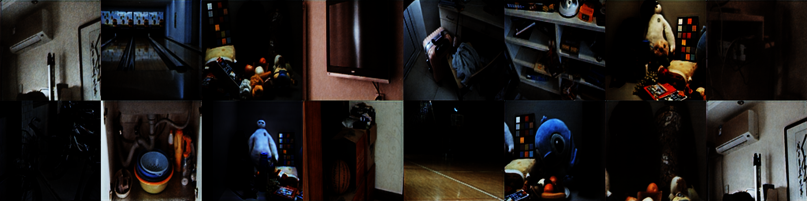
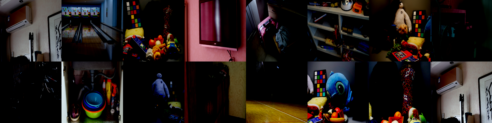

# Diff-Img2Img Studio: 低光照图像增强 (基于扩散模型)

[](https://cloud.189.cn/web/share?code=AJ7fUzBbuUzm) (访问码: q2u9)
[](https://github.com/yourusername/INR2RGB)

这是一个基于 PyTorch 和 Diffusers 库的深度学习项目，**核心利用条件扩散模型 (Conditional Diffusion Model)** 进行低光照图像增强。项目结合 **Retinex 理论**，将图像分解为反射率和光照分量，辅助扩散模型进行更稳定的训练和结构恢复。

本项目提供了一个功能强大的 **Web UI (Diff-Img2Img Studio)**，集成了数据准备、训练、评估和可视化的全流程。

## ✨ 项目特点

-   **统一引擎架构**: 基于 `core/engine.py` 的 `DiffusionEngine`，统一管理训练、验证和推理，支持 `accelerate` 分布式加速。
-   **全流程 Web UI**: 提供基于 Streamlit 的交互式界面：
    -   **数据合成**: 使用 `Darker` 引擎基于物理模型（Gamma、噪声、车灯）合成低光照数据。
    -   **训练监控**: 实时查看 Loss 曲线和学习率。
    -   **评估与可视化**: 计算 PSNR/SSIM/LPIPS 指标并对比增强效果。
-   **先进损失函数**: 结合 **Min-SNR diffusion loss** 与低时间步 **Charbonnier / SSIM / LPIPS** 重建分支。
-   **Retinex-Diffusion**: 利用 Retinex 分解引导扩散生成。

## 🖼️ 效果展示

|          输入（低光照）          |      输出（扩散模型增强后）      |
| :------------------------------: | :------------------------------: |
|  |  |

## 🛠️ 环境要求

-   Python 3.8+
-   PyTorch 2.0+
-   CUDA (推荐)

## 🚀 安装步骤

1.  **克隆仓库:**
    ```bash
    git clone https://github.com/yourusername/Diff-Img2Img.git
    cd Diff-Img2Img
    ```

2.  **创建环境:**
    ```bash
    conda create -n diff-img2img python=3.10
    conda activate diff-img2img
    ```

3.  **安装依赖:**
    ```bash
    pip install -r requirements.txt
    ```

## 🖥️ Web UI 使用指南 (推荐)

无需记忆复杂参数，一键启动 Studio：

```bash
python3 main.py --mode ui
```
*(或者: `streamlit run ui/app.py`)*

浏览器将自动打开 `http://localhost:8501`。

## 💻 命令行使用指南

您也可以使用统一的 `main.py` 入口进行操作。

### 1. 训练 (Training)

```bash
accelerate launch main.py --mode train \
    --config configs/train/middle.yaml \
    --data_dir ../datasets/kitti_LOL \
    --output_dir runs/experiment_1 \
    --use_retinex \
    --train_profile auto
```

### 1.1 模型规模配置

| Preset | 目标显存 | Retinex 分支 | 条件编码器 | 主干侧重 |
|------|---------|-------------|-----------|---------|
| `small` | ~8GB | `SmallDecomNet`：轻量 MBConv 风格 | `SmallConditionAdapter`：depthwise/MBConv + 轻量 FiLM | 优先参数量小、效率高、易训练 |
| `small_accum` | ~8GB | `MiddleDecomNet` | `MiddleConditionAdapter` | 用更高梯度累积在 8GB 上运行更大的网络 |
| `middle` | ~8GB / 16GB 更舒适 | `MiddleDecomNet`：3-scale + global context | `MiddleConditionAdapter`：均衡双分支条件编码 | 质量与速度均衡 |
| `middle_accum` | ~16GB | `MaxDecomNet` | `MaxConditionAdapter` | 通过梯度累积运行更强的质量型结构 |
| `max` | 64GB+ | `MaxDecomNet`：更深的质量优先 Retinex | `MaxConditionAdapter`：transformer/global refinement | 最大化恢复质量 |
| `max_accum` | 64GB+ | `MaxDecomNet` | `MaxConditionAdapter` | 比 `max` 更大的扩散主干，偏上限实验 |

内置配置文件：

- `configs/train/small.yaml`
- `configs/train/small_accum.yaml`
- `configs/train/middle.yaml`
- `configs/train/middle_accum.yaml`
- `configs/train/max.yaml`
- `configs/train/max_accum.yaml`

### 2. 预测 (Inference)

**单图/文件夹:**
```bash
python3 main.py --mode predict \
    --model_path runs/experiment_1 \
    --data_dir ../datasets/test_images \
    --output_dir predictions \
    --use_retinex
```

**视频:**
```bash
python3 main.py --mode predict \
    --model_path runs/experiment_1 \
    --video_path input_video.mp4 \
    --output_dir video_results \
    --use_retinex
```

### 3. 验证 (Validation)

```bash
python3 main.py --mode validate \
    --model_path runs/experiment_1 \
    --data_dir ../datasets/kitti_LOL \
    --use_retinex
```

## 📂 项目结构

```
/
├── core/               # 核心引擎逻辑
│   └── engine.py       # DiffusionEngine 类
├── models/             # 网络模型定义
│   ├── diffusion.py    # 条件 UNet 封装
│   └── retinex.py      # Retinex 分解网络
├── ui/                 # Streamlit Web 界面
│   └── app.py
├── scripts/            # 工具脚本
│   ├── darker.py       # 数据合成引擎
│   └── visual_val.py   # 可视化辅助
├── datasets/           # 数据加载逻辑
├── utils/              # 辅助函数 (Loss, Metrics)
├── main.py             # 统一入口脚本
└── legacy/             # 旧版独立脚本 (已废弃)
```

## 📄 许可证

[MIT License](LICENSE)

## 🤝 联系方式

如有任何问题，请提交 GitHub Issues 或联系：huangxiaohai99@126.com
